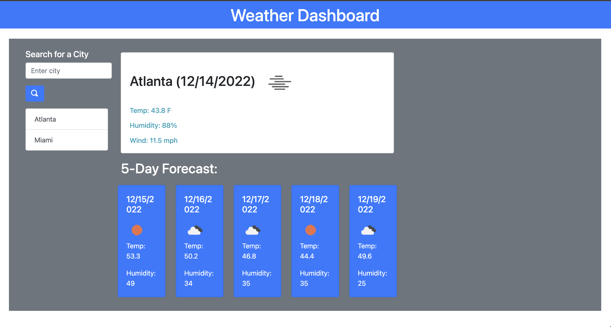

# challenge-6-weather-dashboard
## Description

As a user, I want to have an application that I can search a city to track the weather for the current day and the next five days along with their corresponding dates. I want to be able to click on previous searched cities and see the current weather and their five day forecast.

## Links
https://isthatsilva.github.io/challenge-6-weather-dashboard/

